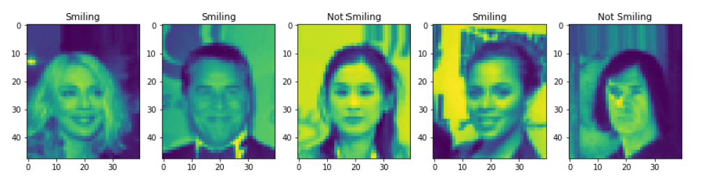
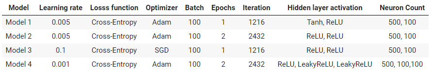

# Smile-Detection-Using-CelebA-Dataset
 This is a deep learning project using python with the help of PyTorch. This project has been made in Google Colab. We have studied performance of 4 simple deeplearning models in recognizing smiles from celebrity images.

:fleur_de_lis:**Some demo images :**

:fleur_de_lis:**4 model configurations :**

:fleur_de_lis:**The analysis report can be found in the provided pdf.**
